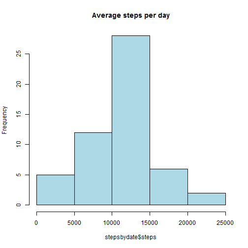
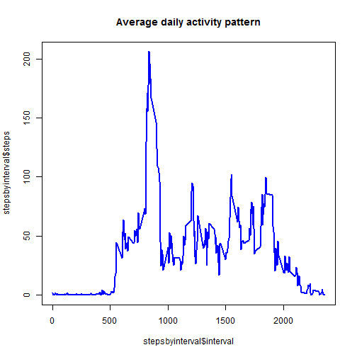
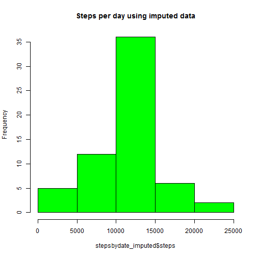
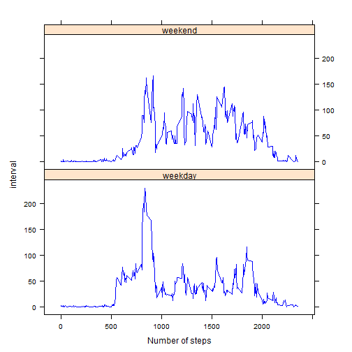

#### Reproducible Research: Peer Assessment 1

## Loading and preprocessing the data

```r
setwd('/Users/ratnasri/Desktop/Ratna/DS2014_Ratna/mygit/RepData_PeerAssessment1')
activity_df <-  read.csv("activity.csv",stringsAsFactors=FALSE)
#Remove NAs
cleaned_df <- activity_df[complete.cases(activity_df)==TRUE,]
#Examine data
head(cleaned_df)
```

```
##     steps       date interval
## 289     0 2012-10-02        0
## 290     0 2012-10-02        5
## 291     0 2012-10-02       10
## 292     0 2012-10-02       15
## 293     0 2012-10-02       20
## 294     0 2012-10-02       25
```


## What is mean total number of steps taken per day?

```r
stepsbydate <- aggregate(steps ~ date, data = cleaned_df,sum)
hist(stepsbydate$steps,col="light blue",main="Average steps per day")
```

 

##Mean and median

```r
mean(stepsbydate$steps)
```

```
## [1] 10766
```

```r
median(stepsbydate$steps)
```

```
## [1] 10765
```

## What is the average daily activity pattern?

```r
stepsbyinterval <- aggregate(steps ~ interval,data=cleaned_df, mean)
plot(stepsbyinterval$interval,stepsbyinterval$steps,
	type="l",col="blue",lwd=2,main="Average daily activity pattern")
```

 

```r
#Interval with maximum steps
stepsbyinterval[stepsbyinterval$steps== 
	max(stepsbyinterval$steps),]$interval
```

```
## [1] 835
```


## Imputing missing values

```r
#Compute number of rows with missing values
nrow(activity_df)-nrow(cleaned_df)
```

```
## [1] 2304
```

```r
#Compute mean by data
meanbyinterval <- aggregate(steps ~ interval, data=activity_df, mean)
colnames(meanbyinterval)[2] <- "meansteps"
#Create a new dataset with missing data filled in
activity_mean_df <-
  merge(activity_df,meanbyinterval,by="interval",all.x=TRUE)
temp_df <- lapply(1:nrow(activity_mean_df), function(x) {
      if (is.na(activity_mean_df[x,2])) 
            activity_mean_df[x,2] <<- activity_mean_df[x,4]})
#cleanup
rm(temp_df)
activity_mean_df$meansteps <- NULL
#Check summary
summary(activity_mean_df)
```

```
##     interval        steps           date          
##  Min.   :   0   Min.   :  0.0   Length:17568      
##  1st Qu.: 589   1st Qu.:  0.0   Class :character  
##  Median :1178   Median :  0.0   Mode  :character  
##  Mean   :1178   Mean   : 37.4                     
##  3rd Qu.:1766   3rd Qu.: 27.0                     
##  Max.   :2355   Max.   :806.0
```

```r
#Make a histogram of the total numberof steps taken each day using imputed data
stepsbydate_imputed <- aggregate(steps ~ date, data = activity_mean_df,sum)
hist(stepsbydate_imputed$steps,col="green",main="Steps per day using imputed data")
```

 

```r
#Compute mean and median
mean(stepsbydate_imputed$steps)
```

```
## [1] 10766
```

```r
median(stepsbydate_imputed$steps)
```

```
## [1] 10766
```


## Are there differences in activity patterns between weekdays and weekends?


```r
f <- function(x) { ifelse((weekdays(as.Date(x)) %in% c('Saturday','Sunday')),
                    'weekend','weekday')}
activity_mean_df$weekday <- sapply(activity_mean_df$date,f)


temp_df <-  aggregate(steps ~ interval,
		 data=activity_mean_df[activity_mean_df$weekday=="weekday",],
		     mean)

temp_df$weekday <- "weekday"


temp_df2 <- aggregate(steps ~ interval,
		      data=activity_mean_df[activity_mean_df$weekday=="weekend",],
		      mean)
temp_df2$weekday <- "weekend"
final_df <- rbind(temp_df,temp_df2)

#Cleanup
rm(temp_df)
rm(temp_df2)

#Draw plot
library(lattice)
xyplot(steps ~ interval | factor(weekday), data=final_df,
		aspect=1/2, type="l",col="blue",
		xlab="Number of steps",
		ylab="interval")
```

 
